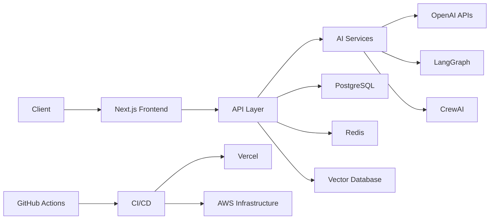
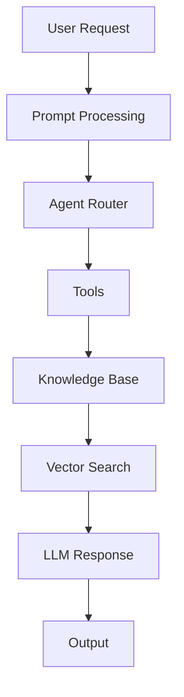
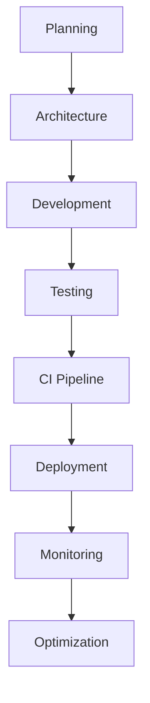

# Muhammad Bilal Khalid

<div align="center">

# AI Engineer • Full-Stack Developer • Distributed Systems Builder

Building AI-native products, agentic systems, cloud infrastructure, and scalable software architectures.

[](https://bilalkhalidshaikh.vercel.app)
[](mailto:bilalkhalid.dev@outlook.com)
[](https://github.com/bilalkhalidshaikh)
[](https://linkedin.com/in/bilalkhalidshaikh)

</div>

---

## About

Software engineer specializing in:

* Agentic AI Systems
* Multi-Agent Orchestration
* Retrieval-Augmented Generation (RAG)
* Distributed Systems
* Cloud Infrastructure
* Full-Stack Product Development
* Workflow Automation
* AI-Powered Applications

My work focuses on building production-grade systems that combine modern software engineering with large language model infrastructure, scalable backend services, and exceptional user experiences.

This repository contains the source code for my personal portfolio, engineering experiments, AI demonstrations, and technical showcases.

---

## Engineering Focus

| Domain               | Expertise                                 |
| -------------------- | ----------------------------------------- |
| AI Systems           | RAG, Agents, Tool Calling, Memory Systems |
| Frontend Engineering | React, Next.js, TypeScript                |
| Backend Engineering  | FastAPI, Node.js, APIs                    |
| Infrastructure       | AWS, Docker, CI/CD                        |
| Data Systems         | PostgreSQL, Redis, Neo4j                  |
| Vector Search        | Pinecone, Qdrant                          |
| Distributed Systems  | Kafka, RabbitMQ, WebSockets               |

---

## Core Technology Stack

### Languages

```text
Python
TypeScript
JavaScript
SQL
```

### Frontend

```text
React
Next.js
TypeScript
Tailwind CSS
Framer Motion
shadcn/ui
```

### Backend

```text
Node.js
FastAPI
Express
Prisma
REST APIs
Serverless Functions
```

### AI Engineering

```text
OpenAI
LangGraph
CrewAI
AutoGen
RAG Pipelines
Prompt Engineering
Multi-Agent Systems
Workflow Automation
```

### Data Layer

```text
PostgreSQL
Redis
Neo4j
Pinecone
Qdrant
```

### Infrastructure

```text
AWS
Docker
GitHub Actions
Vercel
CI/CD Pipelines
Cloud-Native Deployment
```

---

## Portfolio Architecture



---

## AI Engineering Workflow



---

## Development Lifecycle



---

## Technical Interests

* Agentic AI
* AI Infrastructure
* Autonomous Workflows
* Distributed Computing
* Cloud-Native Systems
* Large Language Models
* Vector Databases
* Event-Driven Architecture
* System Design
* Developer Tooling

---

## Engineering Principles

| Principle   | Description                            |
| ----------- | -------------------------------------- |
| Simplicity  | Build maintainable systems             |
| Scalability | Design for growth from day one         |
| Reliability | Production-grade engineering standards |
| Automation  | Remove repetitive processes            |
| Performance | Optimize critical paths                |
| Ownership   | End-to-end accountability              |

---

## Skills Matrix

| Category       | Technologies                        |
| -------------- | ----------------------------------- |
| Languages      | Python, TypeScript, JavaScript, SQL |
| Frontend       | React, Next.js, Tailwind            |
| Backend        | Node.js, FastAPI, Express           |
| AI             | OpenAI, LangGraph, CrewAI, AutoGen  |
| Databases      | PostgreSQL, Redis, Neo4j            |
| Vector Search  | Pinecone, Qdrant                    |
| Infrastructure | Docker, AWS, Vercel                 |
| DevOps         | GitHub Actions, CI/CD               |
| Messaging      | Kafka, RabbitMQ                     |
| Realtime       | WebSockets, Streaming APIs          |

---

## Featured Capabilities

### AI Systems

* Retrieval-Augmented Generation (RAG)
* Agentic Workflows
* Multi-Agent Coordination
* Tool Calling
* Memory Architectures
* Knowledge Systems

### Software Engineering

* Full-Stack Development
* API Design
* System Architecture
* Cloud Infrastructure
* Distributed Systems
* Performance Optimization

### Product Engineering

* Rapid Prototyping
* MVP Development
* SaaS Platforms
* AI Applications
* Internal Tools
* Automation Systems

---

## Local Development

Clone and run locally:

```bash
git clone https://github.com/bilalkhalidshaikh/portfolio.git

cd portfolio

npm install

npm run dev
```

Open:

```text
http://localhost:3000
```

---

## GitHub Analytics


---

## Current Focus

```text
AI Infrastructure
Agentic Systems
RAG Architectures
Workflow Automation
Cloud-Native Applications
Distributed Systems
Full-Stack Engineering
```

---

## Connect

* Portfolio → https://bilalkhalidshaikh.vercel.app
* GitHub → https://github.com/bilalkhalidshaikh
* LinkedIn → https://linkedin.com/in/bilalkhalidshaikh
* X → https://twitter.com/bilalkhalid29
* Email → [bilalkhalid.dev@outlook.com](mailto:bilalkhalid.dev@outlook.com)

---

> Building intelligent systems, scalable infrastructure, and AI-native products.
